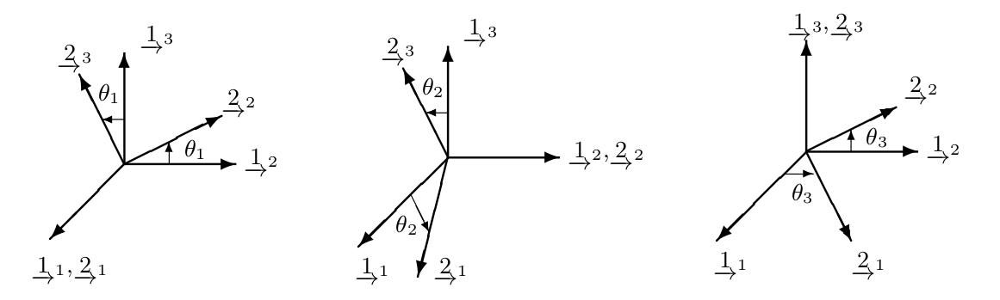
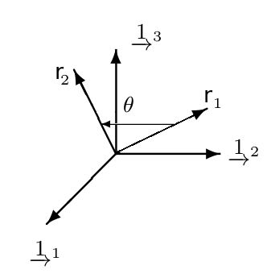

**这是一个ros的工程, 需要通过catkin_make进行编译, 通过rviz可以显示.**
# 关于**Roll-Pitch-Yaw**的终极笔记
首先, 以下所有的记述都是在**右手坐标系**下进行.

## 1. 旋转的基本概念
定义一个向量为$\underrightarrow r$, 两个坐标系为$\underrightarrow {F_1}$和$\underrightarrow {F_2}$, 那么在这两个坐标系下,表示同一个向量可得:
$$
\underrightarrow r = \underrightarrow{F_1^T}\cdot r_1 = \underrightarrow{F_2^T} \cdot r_2
$$
$r_1$和$r_2$分别表示两个坐标系下对应的坐标. 化简可得
$$
\begin{aligned}
r_2 &= R_{21}r_1 \\
\underrightarrow{F_1^T} &= \underrightarrow{F_2^T} \cdot R_{21}
\end{aligned}
$$
对于旋转最重要的有两点:
1. **From ... to ...**;
2. 旋转的定义: 
2.1 坐标系的旋转;
2.2 点/向量在同一坐标的旋转.

## 2. From ... to ...
在旋转之前首先要明确 **From ... to ...** 的问题. 比如从世界坐标系(world)到相机坐标系(camera)的变换可以记做
$$R_{cw}$$
其中, $w$表示世界坐标系, $c$表示相机坐标系. 这个变换的含义之一就是世界坐标系的点$p_w$, 可以转换为相机坐标系的点$p_c$:
$$
p_c = R_{cw} \cdot p_w
$$

注意, 这表示**同一个点**在不同坐标系下的坐标不同. 世界坐标系下为$p_w$, 相机坐标系下为$p_c$.

## 3. 旋转的定义
### 3.1 坐标系的旋转
STATE ESTIMATION for ROBOTICS 6.2.2节定义了坐标系的旋转

其中的$\theta_1$, $\theta_2$, $\theta_3$均为从坐标系$\underrightarrow 1$旋转至$\underrightarrow 2$的角度. 其旋转过程本质上是描述$R_{21}$.

#### 3.1.1 表述坐标转的Roll-Pitch-Yaw
在右手定则的前提下, 所谓Roll-Pitch-Yaw分别表示:
- Roll 绕$x$轴;
- Pitch 绕$y$轴;
- Yaw 绕$z$轴.

以状态估计机器人(STATE ESTIMATION for ROBOTICS) 6.2.2节为例, 其对于**Roll-Pitch-Yaw**的描述和对应的旋转矩阵就是以坐标系旋转为准.
从坐标系$\underrightarrow {F_1}$向$\underrightarrow {F_2}$旋转, 对应的**Roll-Pitch-Yaw**的旋转矩阵为:
- Roll
$$
R_x(\theta_1) = \begin{bmatrix}
1 & 0 & 0 \\
0 & cos\theta_1 & sin\theta_1 \\
0 & -sin\theta_1 & cos\theta_1
\end{bmatrix}
$$
- Pitch
$$
R_y(\theta_2) = \begin{bmatrix}
cos\theta_2 & 0 & -sin\theta_2 \\
0 & 1 & 0 \\
sin\theta_2 & 0 & cos\theta_2
\end{bmatrix}
$$
- Yaw
$$
R_z(\theta_3) =  \begin{bmatrix}
cos\theta_3 & sin\theta_2 & 0\\
-sin\theta_3  & cos\theta_3 & 0 \\
0 & 0 & 1
\end{bmatrix}
$$
- 再次强调, $\theta_1$, $\theta_2$, $\theta_3$均为从坐标系$\underrightarrow {F_1}$向$\underrightarrow {F_2}$旋转的角度.
- 求得的$R_x$, $R_y$, $R_z$本质上都是$R_{21}$
- 其实**Roll-Pitch-Yaw**有另一种表达方式, 就是以点(向量)的旋转为线索, 其旋转矩阵正好为上式的逆.

### 3.2 点的旋转
另一种旋转的表达, 可以看做是同一个坐标系下, 向量由$r_1$旋转至$r_2$的过程.

可以把这种过程想象为在坐标系$\underrightarrow 1$内, 向量为$r_1$; 在坐标系$\underrightarrow 2$内,向量为$r_2$. 本质上仍然是从坐标系$\underrightarrow 1$旋转至$\underrightarrow 2$的旋转过程$R_{21}$.
**但是, 此处的$\theta$和3.1节坐标系旋转的角度求得的旋转矩阵相差一个逆**. 其Roll-Pitch-Yaw的分解也存在与3.1.1中不同的形式(互为逆).

## 4. Eigen对应的运算
关于**Roll-Pitch-Yaw**的运算主要有两个, 将一个旋转矩阵拆分成三个角度, 用三个角度拼成一个旋转矩阵.
### 4.1 拆分

```C++
Eigen::Matrix3d Rdc;
Eigen::Vector3d euler_angle = Rdc.eulerAngles(2, 1, 0);
```
`eulerAngles`的具体说明可以参考`Eigen`官方文档, 其参数2, 1, 0分别对应轴$z$, $y$, $x$的转角.

### 4.2 拼接
```C++
double roll;
double pitch;
double yaw;
Eigen::AngleAxisd roll_axis(roll, Eigen::Vector3d::UnitX());
Eigen::AngleAxisd pitch_axis(pitch, Eigen::Vector3d::UnitY());
Eigen::AngleAxisd yaw_axis(yaw, Eigen::Vector3d::UnitZ());

Eigen::Matrixed R = yaw.matrix() * pitch.matrix() * roll.matrix();
```

对于3.1中的代码可以使用以下方式进行拼接
```C++
Eigen::Matrix3d Rdc;
Eigen::Vector3d euler_angle = Rdc.eulerAngles(2, 1, 0);

Eigen::AngleAxisd roll(euler_angle(2), Eigen::Vector3d::UnitX());
Eigen::AngleAxisd pitch(euler_angle(1), Eigen::Vector3d::UnitY());
Eigen::AngleAxisd yaw(euler_angle(0), Eigen::Vector3d::UnitZ());

Eigen::Matrix3d Rdc_out = yaw.matrix() * pitch.matrix() * roll.matrix()
```

注意`Eigen::AngleAxisd`的运算是以3.2节的方式计算, 而正好为第3.1节的旋转矩阵定义相差一个逆.

## 5. 总结
总体来说, 欧拉角的旋转有3个大坑:
1. **From...to...**;
2. 描述的是**坐标系的旋转角**还是坐标内**向量的旋转角**;
3. 旋转顺序的问题.

在工程交互过程中, 最好是传递四元数或者旋转矩阵, 这样只需要明晰**From...to...**即可.